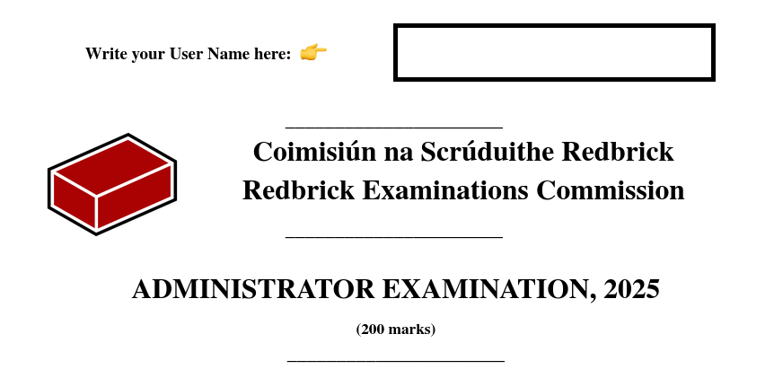

# Admin Root Exam: AGM 2025

- Time allocated: `24 hours`
- Start: `20:00 21/03/2025`
- End: `20:00 22/03/2025`

> [!NOTE]
> You must get 60% in each section to pass. Your overall mark doesn't matter.

> [!WARNING]
> This exam is open book. That doesn't mean you can blindly follow any resource you find online/chatGPT.
> It's your job to use the various resources available to you to complete the given task
> Take the most up to date resource as accurate when it comes to docs / admin info

## Theory Section [75]

### 1. Linux 🐧 [15]

>I'd just like to interject for a moment. What you're refering to as Linux, is in fact, GNU/Linux, or as I've recently taken to calling it, GNU plus Linux.

1. What is POSIX?
2. What does `ulimit` do?
3. How would you find and terminate the process using the most CPU?
4. What are some ways in which to differentiate major branches of Linux?
5. Give a situation where you would use each of the following programs. Give examples of each:
    - `wall`
    - `factor`
    - `df`
    - `dig`
    - `tmux`
6. What is the best Linux distribution for use in servers?
    - Compare it to others that are used in industry

### 2. Redbrick [10]

1. Name current storage servers
2. Name at least 2 killed Redbrick servers
3. What is a bastion host, and how is it used in redbrick infrastructure?
4. How are backups handled on `aperture`?
5. What is Consul? How does it integrate with Nomad?
6. BOFH?

### 3. Networking [10]

> It would be benificial to your grading if you gave the usecase of each of the following in Redbrick (When applicable)

1. What is a subnet? Give a usecase in redbrick.
2. What is NAT? What is it good for?
3. What is a reverse proxy, what are they used for?
4. What is ARP?
5. What is an AAAA record? What is a MX record?
6. What is a VLAN?
7. Give the following subnet masks in CIDR notation:
	- `255.255.255.252`
	- `255.248.0.0`
	- `252.0.0.0`
	- `192.0.0.0`
	- `255.255.255.0`

### 4. Filesystems [15]

1. What RAID would you setup for the following number of disks: (Give your reasoning along with the amount of usable space)
    - 8   100GB drives
    - 10  500GB drives
    - 5   100GB drives and 10   200GB drives

2. Give different methods of file sharing on linux. Give the best one.
3. What is `LVM`? give reasons to why or why not would you use it?
4. Explain what these programs are used for:
	- `rsync`
    - `umount`
    - `tail`
    - `find`
    - `lsof`
5. What are `uid` and `gid`? and how are they used to manage permissions and file ownership?

### 5. Git [12]

1. What is git? What are it's alternatives?
2. You have committed some changes to a git repository. You realise you left out some files from the commit, How would you proceed.
3. You have accidentally included node modules in a remote repo. How would you remove it from the git history?
4. You have your dotfiles in a GitHub repo but want to take some files and features from another repo. How would you set up git to allow you to continuously take new changes from the other repo into your repo?
5. What does CI & CD stand for? Give one example of a tool used for each

### 6. Virtualisation [3]

1. What is the difference between Containers and VMs?
2. What is a virtual IP address? What is a cluster?
3. What is the role of a hypervisor? give and explain each type of hypervisor.

### 7. Misc [10]

1. A careless sysadmin executes the following command: `chmod 444 /bin/chmod` - what do you do to fix this?
2. What kind of keys are in ~/.ssh/authorized_keys and what it is this file used for?
3. Explain the following command `(date ; ps -ef |tail -n +2 | awk '{print $1}' | sort | uniq | wc -l ) >> Activity.log`
4. What is LDAP? How does it differ from AD? How does a RDN differ from a DN?
5. What is a Linux kernel module?

### :tada: Bonus Round! :tada

> Not marked, but you should still attempt

1. As a new sysadmin, what cool new things would you like to improve/introduce in Redbrick?
2. How many pints of Guinness is enough pints of Guinness?
3. What will happen on 19 January 2038?
4. Have ya ever had a pint of guinness?
5. How to fix mail?
---

## Practical Section [125]

> [!NOTE]
> Please include a brief summary of the steps you took to complete each question. Provide photo's when necessary.
> You MUST follow admin instruction for the duration of the exam. Failure to do so may lead to your your disqualification.

### 1. Security [15]

1. Secure your vm to your best ability

> There are many ways to accomplish this, the best approach is a well-rounded holistic one

### 2. LDAP [25]

1. Install an LDAP server on your VM
2. Set up an LDAP server
	- Use `o=blueblock` for the organisation.
	- Create organisation units `groups` and `accounts`
	- Create an LDAP user called `neo` under the organisational unit `accounts`. Use the following credentials for them.

```
user: neo
password: the password to your VM
home: /home/neo
shell: /bin/bash
```

3. Allow `neo` to login over SSH through LDAP
	- This means LDAP user `neo` should be able to log into your VM via `ssh neo@$your-vm` with their password. They shouldn't need a local account to do this.
    - Their home directory should be created upon login if it does not exist.

4. Add neo to a Brickies group
    - Create a `brickies` group in the LDAP
    - Add `neo` to this group

5. Add a gecos for neo
    - Add a gecos attribute for `neo` with his real name

### 3. File Share [10]

1. Set up your VM to provide storage over the network
2. Mount this file share to your local machine and transfer some files
	- Send proof of this (screenshot etc.)

### 4. Database [15]

1. Setup a standalone database for your applications to connect to - *you will be judged by the database you choose*
2. Create a user called `goombean`
3. Leave a special message for the admins and grant `goombean` access to it
4. Backup this database to a file. Paste the path to the file here:

```
```

### 5. Docker [25]

1. Install docker on your vm
2. Set up [HedgeDoc](https://hedgedoc.org/) in a docker container and connect it to a sensible database - *or don't?*
	- any and all HedgeDoc data should be persistent
3. Grab the logs from the HedgeDoc container and paste them here.

```
```

4. Set up a reverse proxy of your choice in a docker container and connect it to HedgeDoc
5. Set up HedgeDoc to use LDAP for auth
	- User `neo` should be able to login with their username and password

### 6. Nomad [15]

1. Install Nomad on your vm
2. Set up a single-node nomad deployment on your vm
3. Deploy an nginx web server using nomad serving static content
4. Proxy this web server through the reverse proxy you set up earlier *(any valid way of achieving this is okay)*
5. Write a script to display all nomad allocations and save their logs to a file. *(Do **NOT** use the web GUI)*

### 7. Scripts [20]

1. Write a cron job to update a git repository with new changes every day

```

```

2. Write cron job to backup all the files on the file share and backup the database

```

```

3. Write a script that updates an LDAP user's password with a randomly generated password

```

```

4. Due to `ayden`'s massive *"homework"* collection `/home` has been completely filled up. Write a script to find the top 10 largest files in `/home`, display them to the user and should the user accept it, delete them.

```

```

5. The admins can never seem to keep their docs up to date. Write a script that will alert them if any file in their git repo is more than 6 months out of date.

```

```

6. Write a fun script that will amuse us

```

```
